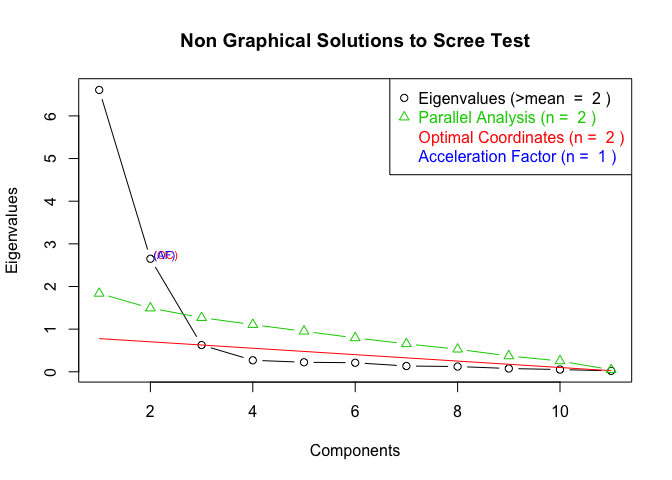

<!-- README.md is generated from README.Rmd. Please edit that file -->
Factor analysis visualization made easy with FAtools
====================================================

[](https://travis-ci.org/mattkcole/FAtools)

From choosing the numbers of factors to extract to inspecting loadings, factor analysis can be very visual in nature. The FAtools R package aims to make this process easier by providing functions to do visualizations with ease.

### To Download:

``` r
library('devtools')
devtools::install_github('mattkcole/FAtools')
```

### Examples:

We can first look at our data (here we are using the possibly cliche but familiar data, mtcars).

``` r
library(datasets)
summary(mtcars)
#>       mpg             cyl             disp             hp       
#>  Min.   :10.40   Min.   :4.000   Min.   : 71.1   Min.   : 52.0  
#>  1st Qu.:15.43   1st Qu.:4.000   1st Qu.:120.8   1st Qu.: 96.5  
#>  Median :19.20   Median :6.000   Median :196.3   Median :123.0  
#>  Mean   :20.09   Mean   :6.188   Mean   :230.7   Mean   :146.7  
#>  3rd Qu.:22.80   3rd Qu.:8.000   3rd Qu.:326.0   3rd Qu.:180.0  
#>  Max.   :33.90   Max.   :8.000   Max.   :472.0   Max.   :335.0  
#>       drat             wt             qsec             vs        
#>  Min.   :2.760   Min.   :1.513   Min.   :14.50   Min.   :0.0000  
#>  1st Qu.:3.080   1st Qu.:2.581   1st Qu.:16.89   1st Qu.:0.0000  
#>  Median :3.695   Median :3.325   Median :17.71   Median :0.0000  
#>  Mean   :3.597   Mean   :3.217   Mean   :17.85   Mean   :0.4375  
#>  3rd Qu.:3.920   3rd Qu.:3.610   3rd Qu.:18.90   3rd Qu.:1.0000  
#>  Max.   :4.930   Max.   :5.424   Max.   :22.90   Max.   :1.0000  
#>        am              gear            carb      
#>  Min.   :0.0000   Min.   :3.000   Min.   :1.000  
#>  1st Qu.:0.0000   1st Qu.:3.000   1st Qu.:2.000  
#>  Median :0.0000   Median :4.000   Median :2.000  
#>  Mean   :0.4062   Mean   :3.688   Mean   :2.812  
#>  3rd Qu.:1.0000   3rd Qu.:4.000   3rd Qu.:4.000  
#>  Max.   :1.0000   Max.   :5.000   Max.   :8.000
```

Let's first make our correlation matrix - we wont worry about scaling or investigating our data much for this demonstration (usually a bad idea).

``` r
corr.matrix <- cor(mtcars)
```

Let's load the packages we need for our analysis:

``` r
library('psych')
library('FAtools')
library('MASS')
```

Lets make and plot our scree plot to assess the number of factors present.

``` r
s.plot <- FAtools::scree_plot(corr.matrix, nrow(mtcars), ncol(mtcars))
plot(s.plot)
```



We can conduct our factor analysis with two factors using the psych package.

``` r
results <- psych::fa(corr.matrix, 2)
#> Loading required namespace: GPArotation
results$loadings
#> 
#> Loadings:
#>      MR1    MR2   
#> mpg  -0.557  0.581
#> cyl   0.688 -0.510
#> disp  0.554 -0.630
#> hp    0.869 -0.171
#> drat -0.143  0.789
#> wt    0.360 -0.736
#> qsec -0.944 -0.328
#> vs   -0.799  0.152
#> am    0.176  0.942
#> gear  0.234  0.920
#> carb  0.835  0.201
#> 
#>                  MR1   MR2
#> SS loadings    4.309 4.093
#> Proportion Var 0.392 0.372
#> Cumulative Var 0.392 0.764
```

The loadings look pretty good, but we can make them more interpretable by excluding low loadings (param: `cutoff`), rounding (param: `roundto`), incorporate a data dictionary, and include labels -- And we can use the knitr::kable() function for great looking tables in Rmarkdown documents.

``` r
library(knitr)
```

``` r
FAtools::loadings_table(results$loadings, 2, cutoff = 0.3, roundto = 2)
#> # A tibble: 11 × 3
#>       V1    V2  Name
#> *  <chr> <chr> <chr>
#> 1  -0.56  0.58   mpg
#> 2   0.69 -0.51   cyl
#> 3   0.55 -0.63  disp
#> 4   0.87          hp
#> 5         0.79  drat
#> 6   0.36 -0.74    wt
#> 7  -0.94 -0.33  qsec
#> 8   -0.8          vs
#> 9         0.94    am
#> 10        0.92  gear
#> 11  0.84        carb
```

Say we had more informative names than `colnames(mtcars)`.

``` r
cool_names <- c("Miles Per Gallon", "Cylinders", "Displacement",
                "Gross horsepower", "Rear Axle ratio", "Weight (1K lbs)",
                "1/4 mile time", "V/S", "Manual", "Number forward gears",
                "Number of carburetors")
```

And say we wern't really all that interested in loadings with an absolute value less than 0.3.

``` r
FAtools::loadings_table(loading_frame = results$loadings, loadings_no = 2,
                        cutoff = 0.3, roundto = 2,
                        Name = colnames(mtcars), 
                        Description = cool_names)
#> # A tibble: 11 × 3
#>       V1    V2           Description
#>    <chr> <chr>                 <chr>
#> 1  -0.56  0.58      Miles Per Gallon
#> 2   0.69 -0.51             Cylinders
#> 3   0.55 -0.63          Displacement
#> 4   0.87            Gross horsepower
#> 5         0.79       Rear Axle ratio
#> 6   0.36 -0.74       Weight (1K lbs)
#> 7  -0.94 -0.33         1/4 mile time
#> 8   -0.8                         V/S
#> 9         0.94                Manual
#> 10        0.92  Number forward gears
#> 11  0.84       Number of carburetors
```

We could also display this graphically, which works well when we have more retained factors or many more variables.

``` r
FAtools::loadings_plot(loadings = results$loadings,
                       cool_names,
                       colorbreaks = c(-.2,0.4,0.6,0.8,1),
                       colors = RColorBrewer::brewer.pal(4,"Greens"))
```


Submit and issue with any concerns!

Credits: Much of the scree plot functionality comes from code provided by: [www.statmethods.net](http://www.statmethods.net/advstats/factor.html)
